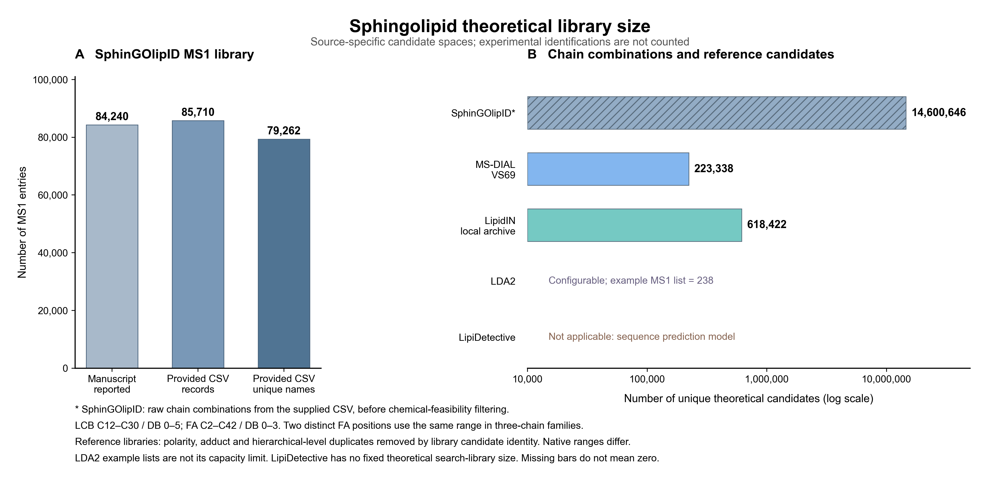

# Sphingolipid theoretical library comparison

本目录保存 2026-09-11 的理论库总量统计结果，不涉及样品重新分析或历史鉴定、RT 结果修改。



- [统计说明、范围及来源](统计说明.md)
- [总量表 CSV](theoretical_library_totals.csv)
- [可编辑 SVG](sphingolipid_theoretical_library_totals.svg)
- [完整汇总 JSON](library_totals.json)

SphinGOlipID 的 14,600,646 为用户指定范围下、未做化学可行性过滤的原始链组合；MS-DIAL 和 LipidIN 为各自来源中的去重参考候选。各软件范围、命名和结构解析粒度不同，不能直接作为鉴定性能对比。LDA2 的 238 仅为官方示例配置；LipiDetective 的固定搜索库容量不适用。

## 文件与复现

现有汇总已经完整保存。只重绘图形可在安装 matplotlib 的 Python 环境中运行：

```powershell
python outputs/theoretical_library_comparison_20260911/make_figure.py
```

该命令仅读取保存的 `library_totals.json`，不重新统计源库，不调用鉴定流程。

`audit_libraries.py`、`count_lipidin.R`、`finalize_totals.py` 保留本次理论库计数与去重实现。它们依赖统计说明中列出的源库，以及脚本内的本机路径；从仓库克隆后不能在缺失源文件时直接重新审计。源库、R 序列化缓存和大型逐候选 TSV 未上传。`lipidin_pos_classes.tsv` 和 `lipidin_neg_classes.tsv` 保存各模式原生类别的记录数，其中也包含非鞘脂类别，不能将整表直接相加作为鞘脂总量。

`primary_audit.json`、`msdial_audit.json` 和 `lipidin_formula_conflicts.json` 保存原始审计摘要。本次上传仅收录结果、说明和必要脚本，不包含实验数据。
